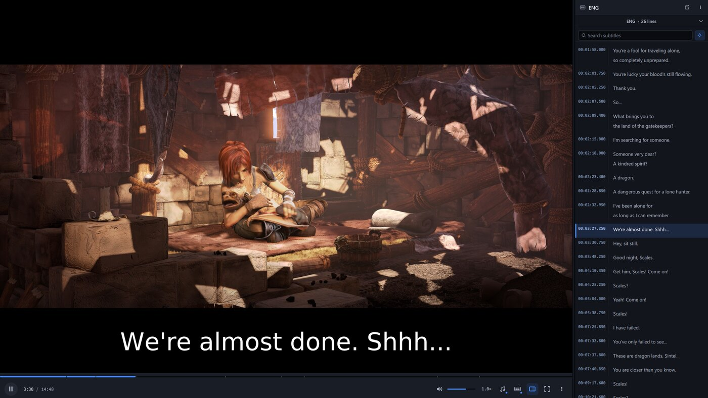
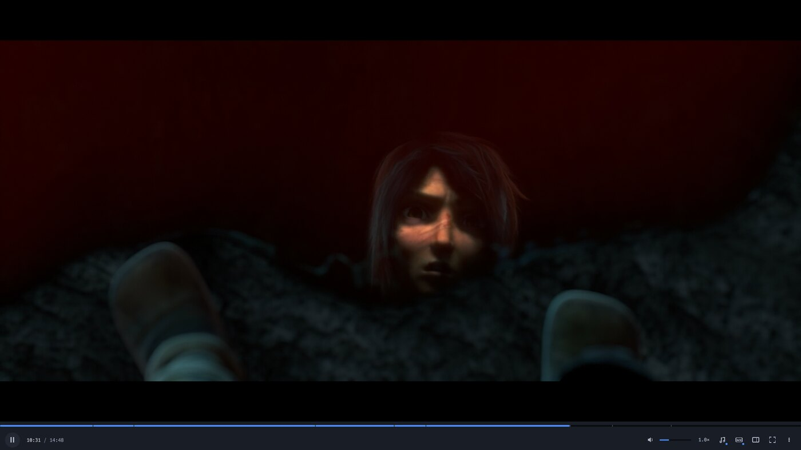
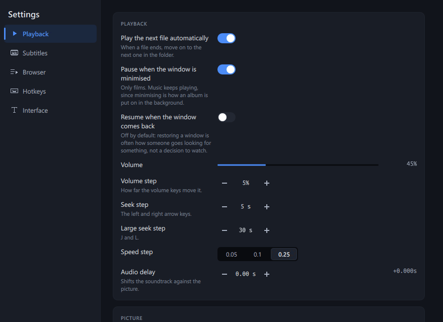

# Subixa

A desktop video player with a docked, searchable subtitle list.

Every line of every subtitle track, timestamped. Click a line to jump to it,
search the whole track, and the line currently playing highlights and scrolls
itself into view. It is built for people who *read* subtitles — language
learners, subtitle editors, anyone doing a QC pass — rather than for people who
happen to have them switched on.



*The highlighted row and the line on the picture are the same cue — the list
follows playback, and clicking any row seeks there.*

> [!IMPORTANT]
> Subixa is pre-release (0.5.0) and there are no downloads yet — no installer,
> no AppImage, no `.deb`, no Flatpak, no packages of any kind. The features are
> finished; what stands between this and a release is release engineering —
> packaging, and CI that has run somewhere other than the development machine.
> Building from source is currently the only way to run it, and on Linux that
> means building three media libraries first.

## Why this exists

Most players treat subtitles as something you *watch*, not something you *read
or search*. PotPlayer is the exception, and its docked subtitle list is the
feature worth rebuilding properly.

That list is the point. Playback is the substrate underneath it.

Subixa is written from scratch rather than forked. VLC, Haruna and SMPlayer all
carry architecture shaped around their own goals; libmpv here is a dependency,
not a base.

## What works today

**The subtitle browser**

- One tab per subtitle track, or a picker when a file has too many for tabs
- Every line as a timestamped row, with full-text search across the track
- The subtitler's own italics, bold and speaker colours rendered rather than
  stripped — read from the ASS styles table as well as the override tags, so
  the browser and the picture agree
- Speaker names above their lines, screenplay-style, on the rows whose ASS
  Name field carries one
- Click a row to seek there; auto-follow highlights the current line and keeps
  it in view
- Search-hit navigation, which stays usable on a 200,000-cue track
- A timing offset applied to the browser's timestamps as well as to the picture,
  including *sync to this line* — pick a line, say when it should be spoken, and
  the offset is computed for you
- Loop one line, copy it with or without its timestamp, export the track as
  `.srt`
- An optional reading-speed readout, flagged past 21 characters a second

**The player underneath it**

- Open or drag-drop, transport controls, a seek bar that previews the line under
  the cursor, playback speed with pitch correction
- Audio and subtitle track selection, chapters, A-B loop, screenshots, audio
  delay
- Subtitle appearance — font, size, colour, outline, shadow, position —
  adjustable while playing rather than in a config file
- Remappable keyboard shortcuts and fullscreen
- Remembers position, subtitle track and layout per file — the first two
  optional, as two independent switches in Settings
- Plays on to the next file in the folder, ordered the way a person would

The browser docks beside the video or detaches into its own window (`Ctrl+D`),
and `Tab` hides it entirely when you just want to watch:



Settings (`Ctrl+,`) covers playback, subtitle appearance and timing, the
browser, hotkeys and the interface. Everything is adjustable while a film is
playing rather than in a config file. Default bindings are in
[`docs/keyboard.md`](docs/keyboard.md).



Screenshots show [*Sintel*](https://durian.blender.org/), © copyright Blender
Foundation, used under [CC BY 3.0](https://creativecommons.org/licenses/by/3.0/).
Its ten embedded subtitle tracks are also why it is a good file to test against.

Verified against a real 3 GB film with 65 embedded subtitle tracks: 93,350 cues
parsed, and click-to-seek landing on the clicked line with the picture to match.

## Requirements

| | |
|---|---|
| Qt | 6.12 or newer |
| FFmpeg | 8.1.x |
| mpv | 0.41 (client API 2.5) |
| libplacebo | 7.360 |
| Compiler | C++23 — gcc 13.3 builds it; gcc 14 is preferable |

These are floors, not compromises. Nothing has shipped, so there is no installed
base to carry and CMake refuses anything older. The gcc note is exact: the tree
uses no C++23 *library* features, so 13.3 compiles it, but 13.3's C++23 library
is incomplete and 14 is where that stops being a constraint.

**No Linux distribution can supply this stack.** Ubuntu 24.04 ships FFmpeg 6.1.1
and apt offers no upgrade, against a requirement of 8.1.x. So the media
libraries are built from source into a prefix of their own, which leaves your
system's `mpv` and `ffmpeg` untouched.

## Building

```bash
git clone https://github.com/akashjose/Subixa.git
cd Subixa
```

Then follow **[`docs/building.md`](docs/building.md)** — the Linux path needs a
list of `-dev` packages and a from-source build of libplacebo, FFmpeg and mpv
via `tools/build-deps.sh`, and Windows builds under MSYS2 UCRT64 with gcc rather
than MSVC. Neither fits honestly in a quickstart.

Once the dependencies exist, one script per platform does the rest:

```bash
tools/install-linux.sh      # Linux:   build a Release tree, then install it
tools/build-win.sh          # Windows: build, run the suites, stage a bundle
```

`install-linux.sh` writes real rpaths, so the installed binary finds Qt and the
media stack with no environment set, and it puts the binary, the desktop entry,
the icon and the AppStream metainfo under the application id
`com.akashjose.Subixa` where a distribution package expects them. It asks for
sudo only when the prefix needs it. There is no CPack configuration and nothing
is signed.

Windows has no system location to install into, so the equivalent step is
packing a folder that carries all 223 DLLs, Qt's plugins, the QML modules and a
`qt.conf`. That is `tools/deploy-win.sh`, which `build-win.sh` calls last,
producing `dist/subixa-win64/`. The suites sit between the build and the packing
deliberately: a bundle that cannot be traced to a green build looks exactly like
one that can.

To work on the code rather than install it, configure a Debug tree by hand — on
Linux:

```bash
export CMAKE_PREFIX_PATH="$HOME/data/Qt/6.12.0/gcc_64"
cmake -S . -B build -G Ninja -DCMAKE_BUILD_TYPE=Debug \
      -DSUBIXA_DEPS_PREFIX="$HOME/data/subixa-stack"
cmake --build build
./build/subixa /path/to/video.mkv
```

## Tests

Ten suites: `subtitles`, `mpvtracks`, `playbackhistory`, `playlist`,
`shortcuts`, `qmlpanel`, `conformance`, `searchproxy`, `assstyles`,
`settingsservice`. An eleventh entry, `rendercanary`, is registered `DISABLED`
under the `manual` label because it needs a display.

Most media fixtures are generated rather than committed, so **a fresh clone must
build them first** — three suites will fail rather than skip without them, which
is deliberate:

```bash
./testdata/make-fixtures.sh
cd build && ctest --output-on-failure
```

`testdata/conformance/` is the exception: 47 KB committed as bytes, so that every
platform decodes identical input and a golden file can pin what the extractor
makes of it. See [`docs/testing.md`](docs/testing.md).

## Documentation

| | |
|---|---|
| [`docs/building.md`](docs/building.md) | full build instructions, Linux and Windows |
| [`docs/roadmap.md`](docs/roadmap.md) | where the project stands and what is next |
| [`docs/architecture.md`](docs/architecture.md) | modules, the design system, the subtitle row |
| [`docs/traps.md`](docs/traps.md) | 26 things that have already cost time |
| [`docs/testing.md`](docs/testing.md) | the suites, the corpus, the render canary |
| [`docs/graphics.md`](docs/graphics.md) | driver selection, and what the Windows port turned up |
| [`docs/keyboard.md`](docs/keyboard.md) | default bindings |
| [`docs/windows.md`](docs/windows.md) | the Windows toolchain and deployment sequence |
| [`CHANGELOG.md`](CHANGELOG.md) | what has been built, milestone by milestone |
| [`CLAUDE.md`](CLAUDE.md) | conventions and environment notes for contributors |

## Contributing

Bug reports and patches are welcome. Read
[`CONTRIBUTING.md`](CONTRIBUTING.md) first — and
[`docs/traps.md`](docs/traps.md) before changing anything in the render or
extraction paths, because most of the surprising behaviour in this codebase is
already written down there.

## License

Subixa is released under the GPL-3.0-or-later license — see
[`LICENSE`](LICENSE) for details. It links libmpv and the FFmpeg libraries,
which carry their own.
